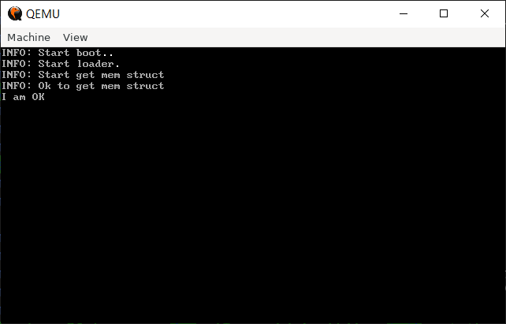
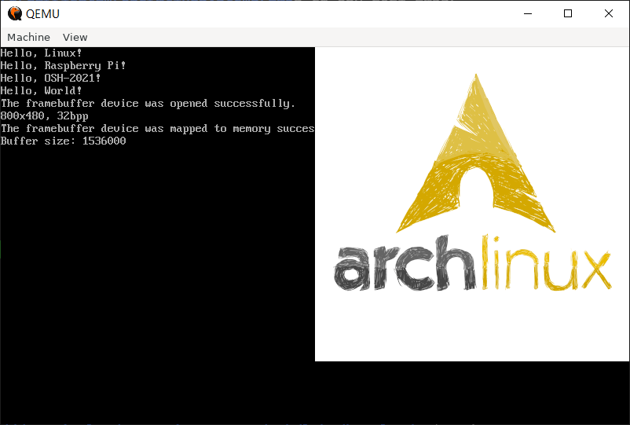
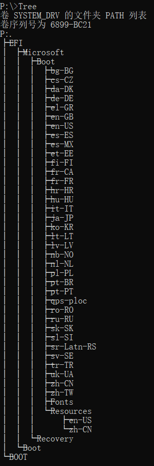

# OSH-Lab01-Report

## boot

1. Makefile

   根据Makefile中内容，通过`make bootloader.img`可实现编译，`make qemu`可在qemu中运行。

2. Problems

   * `jmp $` 又是在干什么？

     进入死循环，便于学习过程中调试

   * `boot.asm` 文件前侧的 `org 0x7c00` 有什么用？

     指定了该代码段的初始绝对地址

   * 尝试修改代码，在目前已有的输出中增加一行输出“I am OK!”，样式不限，位置不限，但不能覆盖其他的输出

     在loader.asm`文件中增加

     ```assembly
     log_info IamOK, 7, 4
     ```

     ```assembly
     IamOK: db 'I am OK'
     ```

     输出结果如图

     

## Init

1. `init.c`

   ```c
   #include <stdio.h>
   #include <unistd.h>
   #include <stdlib.h>
   #include <sys/wait.h>
   #include <sys/types.h>
   #include <sys/stat.h>
   #include <fcntl.h>
   #include <sys/sysmacros.h>
   
   int main()
   {
       
       // Devices
       if (mknod("/dev/ttyS0", S_IFCHR | S_IRUSR | S_IWUSR, makedev(4, 64)) == -1)
       {
           perror("mknod() failed");
       }
       if (mknod("/dev/ttyAMA0", S_IFCHR | S_IRUSR | S_IWUSR, makedev(204, 64)) == -1)
       {
           perror("mknod() failed");
       }
       if (mknod("/dev/fb0", S_IFCHR | S_IRUSR | S_IWUSR, makedev(29, 0)) == -1)
       {
           perror("mknod() failed");
       }
   
       // Run test 1
       int rc1 = fork();
       if (rc1 < 0)
       {
           fprintf(stderr, "fork error\n");
       }
       else if (rc1 == 0)
       {
           if (execl("tools/binary/1", "1", NULL) == -1)
               fprintf(stderr, "execl error1");
       }
       wait(NULL);
   
       // Run test 2
       int rc2 = fork();
       if (rc2 < 0)
       {
           fprintf(stderr, "fork error\n");
       }
       else if (rc2 == 0)
       {
           if (execl("tools/binary/2", "2", NULL) == -1)
               fprintf(stderr, "execl error2");
       }
       wait(NULL);
   
       // Run test 3
       int rc3 = fork();
       if (rc3 < 0)
       {
           fprintf(stderr, "fork error\n");
       }
       else if (rc3 == 0)
       {
           if (execl("tools/binary/3", "3", NULL) == -1)
               fprintf(stderr, "execl error3");
       }
       wait(NULL);
   
       while (1);
       return 0;
   }
   ```

2. 运行测试程序

   ```bash
   qemu-system-aarch64 \
     -kernel linux/arch/arm64/boot/Image \
     -initrd initrd.cpio.gz \
     -dtb tools/boot_utils/bcm2710-rpi-3-b-plus.dtb \
     -M raspi3 -m 1024 \
     -serial stdio \
     -append "rw loglevel=0"
   ```

   

## 思考题

1. 请简要解释 `Linux` 与 `Ubuntu`、`Debian`、`ArchLinux`、`Fedora` 等之间的关系和区别。

   Linux是一种操作系统内核(Kernel)，管理IO操作、内存和进程等。

   Ubuntu、Debian等是linux的distribution。它们在kernel的基础上增加了一些常用设施（如浏览器，播放器等），GNU工具链，库，桌面环境等。

2. 查阅 `PXE` 的资料，用自己的话描述它启动的过程。
   * 客户机通知DHCP服务器其需要使用PXE
   * DHCP服务器返回IP地址
   * 客户机使用上述IP地址向PXE启动服务器请求启动文件
   * 服务器通过TFTP向用户机发送启动文件
   * 客户机使用上述文件启动
   
3. 查阅 `GRUB` 的资料，用自己的话描述它启动的过程。

   GRUB将MBR(Master Boot Record)更换为自己的代码，指向GRUB的配置文件。当计算机启动时，BIOS将控制权转移给启动设备，设备根据MBR的信息将启动程序载入内存，并向其移交控制。GRUB根据配置文件执行启动操作。

4. 说明 `UEFI Boot` 的流程，截图指出你的某一个系统的 `EFI` 分区中包含哪些文件。

   * 流程：根据GUID分区表(GPT)找到EFI分区。EFI分区一般使用FAT家族的文件系统，并存有EFI可执行文件(EFI executables)类型的bootloader。UEFI将执行这种类型的代码，最终启动操作系统。

   * 分区内容浏览

     使用`mountvol P: /S`将EFI分区挂载到`P:`，后使用`cmd.exe`浏览

     

   